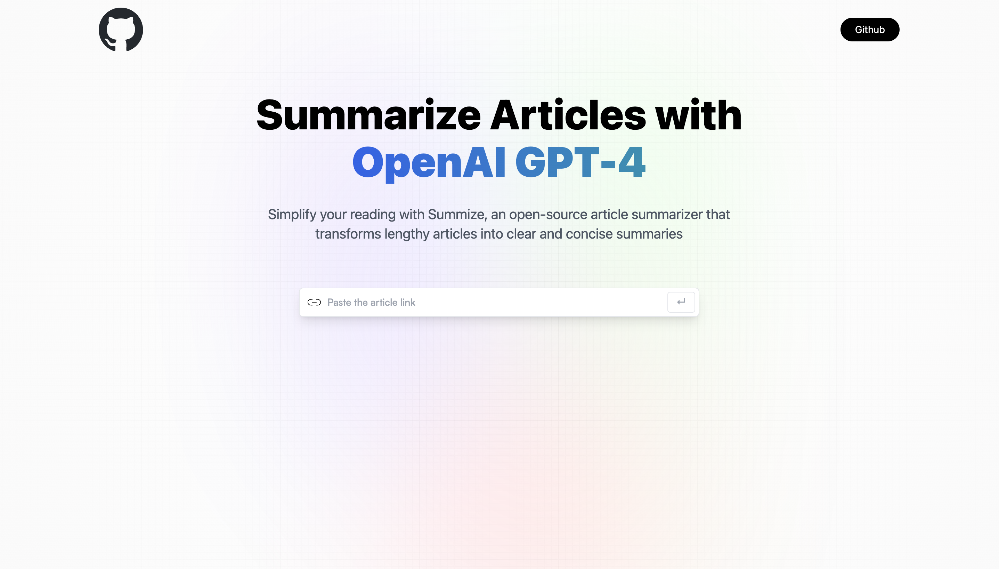

# AI_Summarizer

A web project that leverages the power of machine learning to provide succinct summaries of online articles. Developed with React.js and Vite, it offers a highly responsive and beautiful user interface with a touch of glass morphism, thanks to Tailwind CSS.

## Demo
<br>


## How to Run

To run on local:

```bash
  $ npm install 
  $ npm run dev
```
To upload:

```bash
  $ npm run build 
```
If npm not install, to download node.js

---

## API Setup

In order to use the Article Extractor and Summarizer API, you need to sign up on RapidAPI and get your API key from https://rapidapi.com/restyler/api/article-extractor-and-summarizer. Once you have your key, add it to your `.env` file:

```bash
REACT_APP_RAPIDAPI_KEY=your_api_key_here
```

Remember to replace "your_api_key_here" with your actual API key.

## Usage

Once the project is up and running, you can start using it to summarize articles. 

1. Open your web browser and navigate to `http://localhost:3000`.
2. You will see an input field. Enter the URL of the article you want to summarize.
